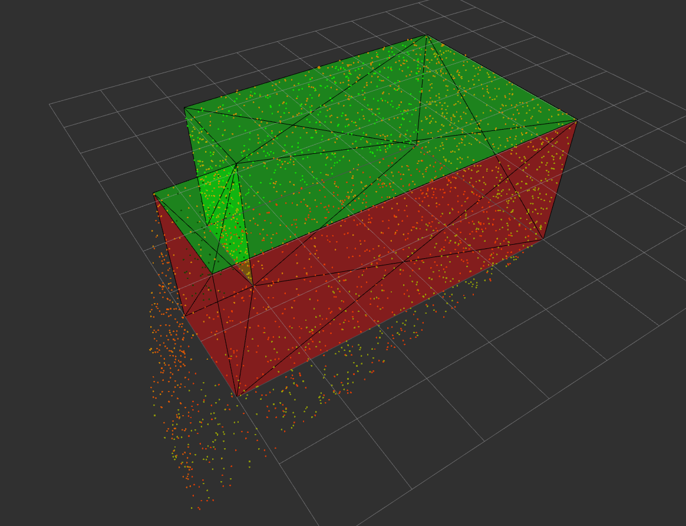

*SRD pipeline is implemented in separate package.*

# Relative Deviations

The package "Relative Deviations" implements the necessary tools and pipeline to detect deviations between a mesh model and a building (as-built). Currently, this tool focuses on flat walls (planes in general), but will be extended by other geometric primitives. Deviations are computed relatively to given references for a task. This is realized by doing "Selective ICP". The computed transformation from ICP can be used to update the pose estimation from the robot.

## Scenarios

### Static Room Deviations (SRD)

"Static Room Deviations" describes a test case for demonstration and testing. A 3D mesh model of a simple room is created and converted into a deviated point cloud for testing purposes. The same pipeline as for online usage is used, however, the used point cloud is much denser and complete than what we get from a LiDAR.

"srd.launch" launches a demonstration of the pipeline. A mesh model and a corresponding deviated reading pointcloud is created. The pipeline is executed just once on this static data. Parameter "test" is set to "true".

```
roslaunch srd_relative_deviations srd.launch
```



### Relative Deviations (RD)

"Relative Deviations" describes the real, online scenario. The ROS node subscribes the reference-aligned point cloud and executes an deviation analysis. Alignment to reference facets happens in cpt_selective_icp, which also sends updates to the state estimator.

## Status

- [x] SRD tested and working
- [x] Adapted to new findCoplanarFacets
- [x] Relative deviations working on real data

## Dependencies

Requires CGAL-4.13.1 (set in cgal_catkin)

## GTest

Run GTests:

```
catkin run_tests <package_name>
```

## Installation 

Pay attention not to overlay or chain other workspaces by sourcing ROS installation first:
```
source /opt/ros/kinetic/setup.bash
echo "source /opt/ros/kinetic/setup.bash" >> ~/.bashrc
```

```
mkdir -p ~/megabot_ws/src
cd ~/megabot_ws
catkin init
catkin config --extend /opt/ros/kinetic
catkin config --merge-devel
catkin config -DCMAKE_BUILD_TYPE=Release
```

```
cd ~/megabot_ws/src/
git clone git@github.com:ethz-asl/cad-percept.git
wstool init
wstool merge cad-percept/dependencies.rosinstall
wstool merge cad-percept/relative_deviations/dependencies.rosinstall
wstool update
wstool merge eth_robotics_summer_school_2019/dependencies.rosinstall
wstool update
```

```
cd ~/megabot_ws/
catkin build relative_deviations
```

```
source devel/setup.bash
echo "source ~/megabot_ws/devel/setup.bash" >> ~/.bashrc
```

Currently, from summer school only following packages and dependencies needed:

```
catkin build ethzasl_icp_mapper smb_tf_publisher smb_state_estimator 
```

If necessary install other dependencies of summer school by apt.


## Launch

Terminal A:
```
roscore
```

Terminal B:

```
rosparam set use_sim_time true
rosbag play --clock <path_to_bag_file>/cla_garage_slam_1.bag
```

Terminal C:

```
roslaunch smb_state_estimator smb_state_estimator_standalone.launch
```

Terminal D:

```
roslaunch cpt_selective_icp supermegabot_selective_icp_no_rviz.launch
```

Terminal E:

```
roslaunch relative_deviations online.launch
```

Terminal F:
** Why is Marker and Model only shown when rosbag is playing?**

```
roslaunch cad_interface cad_interface.launch
```

Now align /velodyne_points and then right-click on Marker and "Load CAD".
Now observe /corrected_scan and /ref_corrected_scan (only for selective ICP)

Hint:
- For better alignment of Marker, deactivate Mesh Model. Marker can not be accessed through mesh.
- There is a second interactive marker (red), which can be used to find closest facet ID to this marker. It is important to load the CAD first. Somehow the first projection on the facet is not shown in rviz.
- Pay attention when looking at visualizations in rviz since sometimes rviz is inaccurate with showing current message when simulation is paused. Deactivate and activate marker again to show correctly when simulation paused.
- Change SMB Confusor config according to robot: waco_calibration.cfg or smb_calibration.cfg

## Instructions

Use service to set reference facets, otherwise whole model is used with normal ICP and deviation analysis not triggered:

```
rosservice call /set_ref "data:
- 14
- 1"
```

e.g.

```
cd megabot_ws/src/cad-percept/cpt_selective_icp/script/
sh publish_references.sh
```

Analysis of complete map:

Requirements:

- Scan callback still needs to run
- Mapping in cpt_selective_icp turned on
- "visualize" parameter in relative_deviations to "map" (this will not publish anything until service was executed)
- RANSAC instead of Region Growing because of computational time
- full map segmentation is extremely slow

```
rosservice call /analyze_map
```
